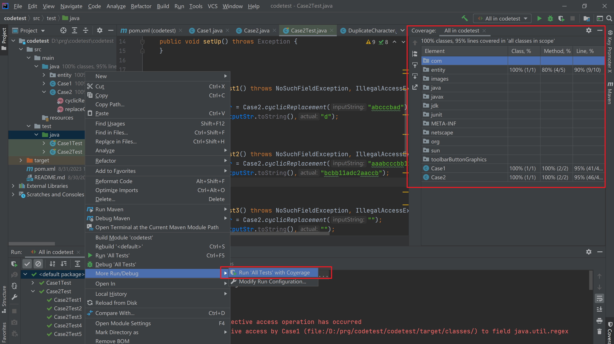

#Development environment
IntelliJ IDEA
jdk-11.0.3
junit v4.13

#Case1
For a given string that only contains alphabet characters a-z, if 3 or more consecutive characters are identical, remove them from the string. Repeat this process until there is no more than 3 identical characters sitting besides each other.

#Case2
Instead of removing the consecutively identical characters, replace them with a single character that comes before it alphabetically. 

#Unit test coverage reports

